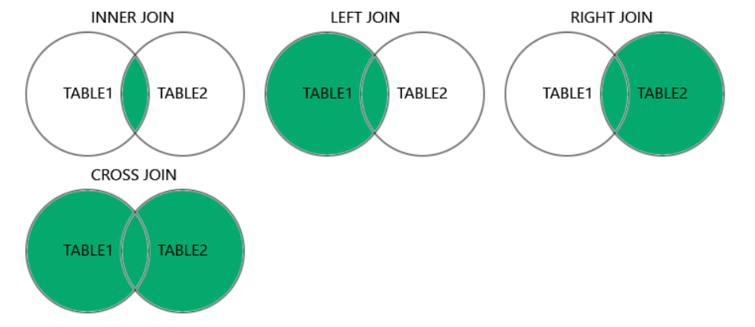

# MySQL
## I. Giới thiệu chung
- download: [MySQL Community Server v8.4.6 LTS](https://dev.mysql.com/downloads/mysql/)
- run MySQL 
``` bash
# ~\MySQL\bin>
mysql.exe -u<user> -p<password>
```
## II. Kiến trúc MySQL
## III. MySQL command line
### 1. Database
#### CREATE DATABASE
``` sql
CREATE DATABASE <Database_name>;
```
#### DROP DATABASE
``` sql
DROP DATABASE <Database_name>;
```
#### USE DATABASE
``` sql
USE <Database_name>
```
### 2. TABLE
#### Tạo bảng 
- Tạo bảng trống
``` sql
CREATE TABLE <Table_name>;
```
- Tạo bảng lấy dữ lệu từ bản khác
``` sql
CREATE TABLE <Table_new> 
AS SELECT <feild> from <Table_name>;
```
#### Xoá bảng
```sql
DROP TABLE table_name;
```
#### Mô tả các thông tin của bảng
``` sql
DESC <Table_name>;
```
### 3. SELECT
- SELECT thường dùng để chọn dữ liệu từ database 
- Hiển thị một phần dữ liệu
``` sql
SELECT <feild ...> FROM <Table_name>;
``` 
- Hiển thị toàn bộ dữ liệu
``` sql
SELECT * FROM <Table_name>;
``` 
### 4. WHERE
- WHERE được dùng để sử dụng để lọc bản ghi
``` sql
SELECT <feild ...> FROM <Table_name> 
WHERE <condition ...>;
```
### 5. Operators
#### Toán tử so sánh
|Operator|Description|
|:-------|:----------|
|=|	Bằng	|
|>|	lớn hơn	|
|<|	nhỏ hơn	|
|>=|	lớn hơn hoắc bằng	|
|<=|	nhỏ hơn hoặc bằng	|
|<>|	khác|

#### Toán tử quan hệ
|Operator|Description|
|:-------|:----------|
|AND| hiển thị bảng ghi nếu tất cả điều kiện được phân tách bằng AND đều đúng  | 
|OR|hiển thị bảng ghi nếu một trong số điều kiện được phân tách bằng OR đều đúng|
|NOT|hiển thị một bản ghi nếu điều kiện KHÔNG ĐÚNG|

#### IN
- ``IN`` Chỉ định nhiều giá trị có thể có cho một cột
``` sql
SELECT column_name(s)
FROM table_name
WHERE column_name IN (value1, value2, ...);
```

#### BETWEEN
- BETWEEN chỉ định giá trị giữa dải	
``` sql
SELECT column_name(s)
FROM table_name
WHERE column_name BETWEEN value1 AND value2;
```

#### LIKE
- LIKE được tìm kiếm một mẫu đã được chỉ định trong một trường.
``` sql
SELECT column1, column2, ...
FROM table_name
WHERE columnN LIKE pattern;
```
- Có hai ký tự đại diện thường được sử dụng kết hợp với toán tử LIKE:

    - % : biểu thị không, một hoặc nhiều ký tự
    - _ : biểu thị một ký tự đơn

| Toán tử | Mô tả |
|:--------|:------|
| 'a%' |Tìm bất kỳ giá trị nào bắt đầu bằng "a"|
| '%a' |Tìm bất kỳ giá trị nào kết thúc bằng "a"|
| '%or%'| Tìm bất kỳ giá trị nào có "or" ở bất cứ vị trí nào |
| '_r%' | Tìm bất cứ giá trị nào có "r" ở vị trí thứ 2 |
| 'a_%' | Tìm bất kỳ giá trị nào bắt đầu bằng "a" và có độ dài ít nhất 2 ký tự |
| 'a__%' |Tìm bất kỳ giá trị nào bắt đầu bằng "a" và có độ dài ít nhất 3 ký tự|
| 'a%o' |Tìm bất kỳ giá trị nào bắt đầu bằng "a" và kết thúc bằng "o"|

### 6. ORDER BY
- ORDER BY dùng để sắp xếp dữ liệu  tăng/giảm dần trong bảng
    - ASC : Sắp xếp theo thứ tự tăng dần
    - DESC: Sắp xếp theo thứ tự giảm dần
``` sql
SELECT <feild ...> 
FROM <Table_name>
ORDER BY <feild ...> <ASC|DESC>;
```

### 7. INSERT INTO
- INSERT INTO dùng để chèn phần tử vào bản ghi 
``` sql
INSERT INTO table_name (feild1, feild2, feild3, ...)
VALUES (value1, value2, value3, ...);
```

### 8. NULL
- NULL là trường không có giá trị. Được dùng trong các điều kiện so sánh 
``` sql
SELECT <feild ...>
FROM <table_name>
WHERE <feild ...> IS (NOT) NULL;
```

### 9. UPDATE
- UPDATE được sử dụng để sửa đổi các bản ghi hiện có trong một bảng.
``` sql
UPDATE <table_name>
SET feild1 = value1, feild2 = value2, ...
WHERE <condition ...>;
```

### 10. DELELTE 
- DELETE được sử dụng để xóa các bản ghi hiện có trong một bảng.
```sql
DELETE FROM <Table_name> 
WHERE <condition ...>;
```

### 11. LIMIT
- LIMIT được sử dụng để chỉ định số lượng bản ghi cần trả về.
- LIMIT hữu ích trên các bảng lớn với hàng nghìn bản ghi.Việc trả về một số lượng lớn bản ghi có thể ảnh hưởng đến hiệu suất.
``` sql
SELECT <feild ...> FROM <Table_name> 
WHERE <condition ...> 
LIMIT number;
```
### 12. AS 
- AS được sử dụng để đặt tên tạm thời cho một bảng hoặc một cột trong bảng. 
- Tên chỉ tồn tại trong khoảng thời gian của truy vấn đó.
``` sql
SELECT column_name AS alias_name
FROM table_name;
```

### 13. Joins
- JOIN được sử dụng để kết hợp các hàng từ hai hoặc nhiều bảng, dựa trên cột có liên quan giữa chúng.
- các loại JOIN được hỗ trợ trên MySQL



#### i. INNER JOIN
- ``INNER JOIN`` chọn tất cả các hàng từ cả hai bảng miễn là có sự trùng khớp giữa các cột. Nếu có bản ghi trong bảng "table1" không trùng khớp với "table2", những đơn hàng này sẽ không được hiển thị!
``` sql
SELECT <feild ...>  
FROM <Table_name1>
INNER JOIN <Table_name2> 
ON table1.column_name = table2.column_name;
```

#### ii. LEFT JOIN
- LEFT JOIN trả về tất cả các bản ghi từ bảng bên trái (table1) và các bản ghi khớp (nếu có) từ bảng bên phải (table2).
``` sql
SELECT <feild ...>  
FROM <Table_name1>
LEFT JOIN <Table_name2> 
ON table1.column_name = table2.column_name;
```

#### iii. RIGHT JOIN
- RIGHT JOIN trả về tất cả các bản ghi từ bảng bên phải (table2) và các bản ghi khớp (nếu có) từ bảng bên trái (table1).
``` sql
SELECT <feild ...>  
FROM <Table_name1>
RIGHT JOIN <Table_name2> 
ON table1.column_name = table2.column_name;
```

#### iv. CROSS JOIN
- CROSS JOIN trả về tất cả các bản ghi từ cả hai bảng (table1 và table2).
``` sql
SELECT <feild ...>  
FROM <Table_name1>
CROSS JOIN <Table_name2> ;
```

### 14. UNION
- UNION được sử dụng để kết hợp tập kết quả của hai hoặc nhiều câu lệnh SELECT.

    - Mỗi câu lệnh SELECT trong UNION phải có cùng số cột
    - Các cột cũng phải có kiểu dữ liệu tương tự
    - Các cột trong mỗi câu lệnh SELECT cũng phải có cùng thứ tự
- UNION chỉ cho phép chọn giá trị riêng biệt
```sql
SELECT column_name(s) FROM table1
UNION
SELECT column_name(s) FROM table2;
```
- UNION cho phép chọn cả các giá trị trùng lắp
``` sql
SELECT column_name(s) FROM table1
UNION ALL
SELECT column_name(s) FROM table2;
```


### 15. GROUP BY
- GROUP BY nhóm các hàng có cùng giá trị vào các hàng tóm tắt, chẳng hạn như "tìm số lượng khách hàng ở mỗi quốc gia".

- GROUP BY thường được sử dụng với các hàm tổng hợp (COUNT(), MAX(), MIN(), SUM(), AVG()) để nhóm tập kết quả theo một hoặc nhiều cột.
``` sql
SELECT column_name(s)
FROM table_name
WHERE condition
GROUP BY column_name(s)
ORDER BY column_name(s);
```
### 16. HAVING
- HAVING được thêm vào SQL vì từ khóa WHERE không thể được sử dụng với các hàm tổng hợp
```sql
SELECT column_name(s)
FROM table_name
WHERE condition
GROUP BY column_name(s)
HAVING condition
ORDER BY column_name(s);
```

### 17. EXISTS
- EXISTS được sử dụng để kiểm tra sự tồn tại của bất kỳ bản ghi nào trong một truy vấn con.
- EXISTS trả về TRUE nếu truy vấn con trả về một hoặc nhiều bản ghi.
```sql
SELECT column_name(s)
FROM table_name
WHERE EXISTS
(SELECT column_name FROM table_name WHERE condition);
```

## Tối ưu hoá 
